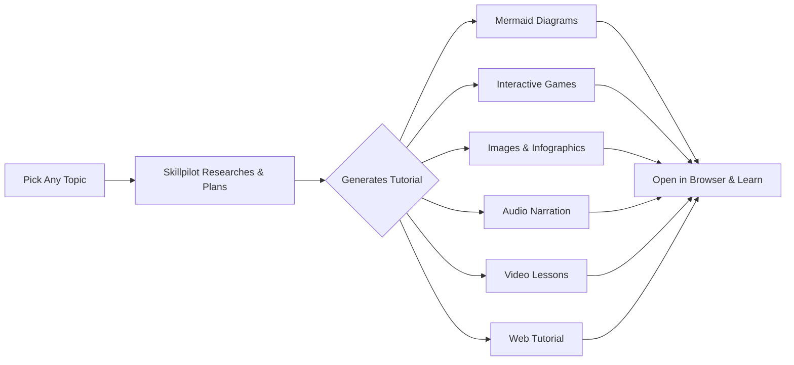

# Skillpilot — Build Your AI Pilot from Scratch

**In the old school, we wrote code. In the age of AI, we work with AI.**

Let's build an AI agent together — your **Skillpilot** — an autonomous AI that sits at your desk, uses your computer, and does real work for you. Not a chatbot. Not a search engine. A pilot that navigates any skill and gets the job done.

## What Is Skillpilot?

Most people think AI is a website where you ask questions and get answers. That's like saying a car is just a radio because you only ever turned on the radio.

Your **Skillpilot** is different. It reads files, runs commands, controls browsers, makes decisions, creates content, and delivers results. Same AI brain, but with hands — and it pilots through any skill you need.

## What Can You Do With It?

- **Explore any topic** — AI, LLMs, coding, math, languages, anything. Your Skillpilot researches, explains, and breaks down any subject for you.
- **Create videos and upload to YouTube automatically** — From generating narration and images to assembling video and publishing — your AI does it end-to-end.
- **Build any skill with vibe coding** — Describe what you want in plain language. Your AI builds it. No syntax, no boilerplate, no debugging.
- **Gain every skill you need in the AI age** — Not just vibe coding. Understand how AI thinks, how agents work, how tools connect, and how to build systems that scale.

## How It Works — The AI-First Workflow

Traditional workflow: you do the work, you figure things out, you document it yourself.

**AI-first workflow:**

1. **Ask AI to do the work** — Give your Skillpilot a task. It plans, picks tools, executes, and delivers.
2. **Ask AI to explain the knowledge behind it** — Don't just get results. Understand the concepts, the reasoning, the "why."
3. **Ask AI to create content from that knowledge** — Guides, walkthroughs, breakdowns — generated automatically.
4. **Ask AI to produce videos from that content** — AI-generated narration, visuals, and assembled video — uploaded to your channel.

This cycle turns every task into deep understanding and shareable content — powered entirely by AI.

## What's Inside This Project

This repo is the home of your Skillpilot and everything it needs to work:

### Core Concepts

| Concept | What It Is |
|---------|-----------|
| **LLM** | The AI brain — processes text, reasons, and makes decisions |
| **Tools & Functions** | The AI's hands — read files, run commands, control browsers, call APIs |
| **Agent** | A while loop: AI thinks, uses tools, checks results, repeats until done |
| **MCP** | Model Context Protocol — a universal standard to connect any AI to any tool (USB for AI) |
| **Skills** | Compressed capabilities — one skill replaces dozens of tool descriptions, giving AI expert-level judgment |
| **AI Dev Swarm** | Agents working as a team — researcher, architect, developer, tester, reviewer |
| **Learn Anything** | Your private AI tutor — learn any subject through interactive web tutorials with rich media |

### Learn Anything with Skillpilot

Skillpilot is not just a builder — it's your **private tutor**. Pick any topic you're curious about, and Skillpilot generates interactive web-based tutorials tailored to you.

**Subjects — from technical to creative, anything you're interested in:**

- AI & LLMs — how models think, train, and reason
- Coding — Python, JavaScript, Rust, system design, algorithms
- Math — algebra, calculus, statistics, linear algebra, discrete math
- Physics — mechanics, electromagnetism, quantum, relativity
- Languages — English, Spanish, Japanese, Mandarin, and more
- Music, History, Biology, Chemistry, Finance — literally anything

**Formats — rich, interactive, and multi-sensory:**

| Format | How Skillpilot Uses It |
|--------|----------------------|
| **Mermaid Diagrams** | Visualize concepts as flowcharts, sequence diagrams, mind maps, and state machines — rendered directly in the browser |
| **Interactive Games** | Learn through quizzes, drag-and-drop exercises, flashcard games, and coding challenges — all generated as web apps |
| **Images** | AI-generated illustrations, diagrams, and infographics that explain visually |
| **Audio** | AI-narrated explanations and pronunciation guides — listen and learn |
| **Video** | Full tutorial videos assembled from AI-generated narration, visuals, and animations |
| **Web Tutorials** | Complete interactive lessons with live code editors, step-by-step walkthroughs, and embedded exercises — all running in your browser |

**How it works:**

```
You: "Teach me how neural networks work"

Skillpilot:
  1. Researches the topic in depth
  2. Breaks it into beginner-friendly lessons
  3. Generates a web tutorial with:
     - Mermaid diagrams showing network architecture
     - Interactive game to build a neuron step by step
     - AI-narrated audio walkthrough
     - Code playground to train a mini model live
  4. Serves it locally — open your browser and start learning
```



> **One AI. Any subject. Every format. Your pace, your curiosity, your private tutor.**

### Project Components

- **Agent Setup** — Install and run Skillpilot locally (OpenCode, CLI, or connect to local models via Ollama for full privacy)
- **YouTube Video Pipeline** — AI generates audio, images, assembles video, and uploads to YouTube automatically
- **MCP Servers** — Connect your AI to any tool through a universal interface (filesystem, Playwright, GitHub, and more)
- **Agent Skills** — Pre-built capabilities that give your AI expert knowledge for specific workflows
- **MCP-to-Skills Converter** — Automatically convert raw tool definitions into compact, intelligent skills
- **Skill Creator** — A meta-skill that teaches AI how to create new skills — the system builds itself
- **Stage Skills** — Full software lifecycle from idea to deployment, each stage handled by a specialized AI skill
- **Code Skills** — Implementation, code review, testing — one agent, many hats

## Build Your Own Tools

Everything here is built with AI, and you can extend it the same way:

1. **Create new skills** — Identify a capability, write a skill prompt, connect it to tools, register it
2. **Add new MCP servers** — Find or build a server for any new capability, convert its tools to skills
3. **Build for your own use case** — Social media management, data analysis, content creation, automation — anything

Your Skillpilot becomes more capable with every skill you add.

## Getting Started

```bash
# Clone the repo
git clone https://github.com/X-School-Academy/skill-pilot.git
cd skill-pilot

# Follow the setup instructions to install your AI agent
# (detailed setup guide coming as we build together)
```

## Contributing

This is an open source project and we're building it together. Every contribution matters — whether it's a new skill, a bug fix, an MCP server integration, or a better way to do things.

### How to Contribute

1. **Fork the repo** — [github.com/X-School-Academy/skill-pilot](https://github.com/X-School-Academy/skill-pilot)
2. **Create a branch** — `git checkout -b my-contribution`
3. **Make your changes** — Use your Skillpilot to help you build
4. **Submit a Pull Request** — Describe what you built and why

### Ways to Contribute

- **New Agent Skills** — Built a skill for a workflow you use daily? Share it. Social media posting, data analysis, email automation, DevOps, design — anything.
- **MCP Server Integrations** — Connected your AI to a new tool or service? Add the server and convert its tools to skills.
- **Video Pipeline Improvements** — Better TTS models, image generation, video assembly, or upload workflows.
- **Documentation & Guides** — Clear walkthroughs that help others get started and extend Skillpilot.
- **Bug Fixes & Improvements** — Found something broken or slow? Fix it and send a PR.
- **Ideas & Discussions** — Open an [issue](https://github.com/X-School-Academy/skill-pilot/issues) to propose new capabilities or discuss approaches.

### Contribution Guidelines

- Use AI to build your contribution — that's the whole point of this project
- Keep skills focused — one skill, one capability
- Include a clear description of what your contribution does and how to use it
- Test your changes before submitting

## Philosophy

> Old school: You write code to make computers do things.
> Age of AI: You tell AI what to do, and AI figures out how.

This project is proof that the shift is real. Every tool, every skill, every video pipeline in this repo was built by working with AI — not by writing code manually. Skillpilot is not just a tool. It's a new way of working.

## License

This project is open source. See [LICENSE](LICENSE) for details.

---

**Let's build Skillpilot together — from scratch. [Join us.](https://github.com/X-School-Academy/skill-pilot)**
