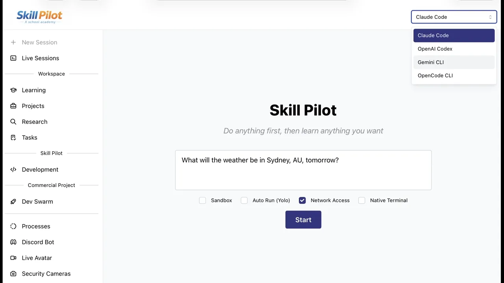

# Skill Pilot AI Agent

**Your personal AI workspace — learn, automate, and build from a single idea.**

> Software runs. Codeware grows.

Whether you are just starting out with AI, a professional who wants to automate your daily work, or a team building a full commercial product — Skill Pilot gives you one unified environment powered by AI agents.

**Join the community:**

💬 [Discord](https://discord.com/invite/myf9RRhfxN) | [𝕏](https://x.com/skill_pilot_ai) | [Reddit](https://www.reddit.com/r/skillpilot/) | [WebChat](assets/webchat-contact.jpg)

## Intro Video



---

## Who Is This For?

### 🌱 Beginners — Learn AI from Zero to Hero

You have heard about AI and vibe coding but don't know where to start. Skill Pilot gives you:

- **Interactive AI courses** generated just for you — no prior coding experience needed
- **Vibe coding** — describe what you want in plain English and watch AI build it
- **Hands-on projects** — spin up real working apps without writing a single line of code yourself
- A structured path from complete beginner to confident AI user

> Start here: open the `workspace/learning/` folder and ask the AI to create a course on any topic.

---

### ⚡ Professionals — Automate Your Daily Work with AI

You already know your domain. Now you want AI to handle the repetitive, time-consuming work — not just in code, but across everything you do. Skill Pilot gives you:

- **Task automation** — delegate writing, research, analysis, planning, and scheduling to AI agents
- **Computer control** — let AI operate your desktop, fill forms, extract data from websites, and interact with any app
- **Remote access** — control servers and cloud infrastructure through natural language
- **Discord and communication bots** — AI-powered assistants that work while you sleep
- A growing library of reusable skills you can trigger anytime

> Start here: open the `workspace/tasks/` folder and describe any task you want automated.

---

### 🏢 Enterprises — Build a Commercial Product from a Single Idea

You have an idea and want to go from concept to a fully deployed, commercial-ready product. Skill Pilot's **Dev Swarm** system handles the entire software lifecycle:

1. **Idea → Requirements** — AI clarifies and structures your business problem
2. **Market Research** — competitive analysis and opportunity identification
3. **Architecture & Tech Specs** — system design, API specs, database schema
4. **Sprint Planning & Development** — feature-by-feature implementation with tests
5. **DevOps & Deployment** — CI/CD, containerization, cloud infrastructure
6. **Monitoring & Iteration** — production-ready and continuously improving

> Start here: write your idea in `ideas.md` and ask Dev Swarm to begin stage 1.

---

### 🎯 Everyone — Master AI and Prepare for the AI Era

The most valuable skill in the next decade is knowing how to work with AI effectively. Skill Pilot is designed to grow with you:

- **Agent skills** you build become reusable assets — your AI gets smarter over time
- **Community knowledge sharing** — learn from and contribute to a growing library of capabilities
- **Multi-agent workflows** — chain AI agents together to solve complex, multi-step problems
- **Your personal AI habitat** — a workspace that evolves as you do

---

## What Is Skill Pilot?

Skill Pilot is an **AI-native workspace** you run locally. It connects your favorite AI coding agents (Claude Code, Codex, Gemini CLI, and more) to a structured environment of reusable skills, tools, and workflows.

Instead of using AI as a chat assistant, Skill Pilot turns AI into an active worker that:

- Reads and modifies your codebase
- Executes tasks on your computer
- Learns new capabilities through reusable "skills"
- Operates across your entire digital workflow — not just code

**In short:** You describe what you want. The AI does it. The system gets better every time.

---

## What Is Codeware?

Traditional software is static — it ships with fixed features that only change when developers update it.

**Codeware is different.** The source code itself is the product, and AI continuously extends it based on what you need.

```
Traditional:  Human → UI → Software → Fixed behavior
Codeware:     Human → AI → Codebase → Evolving behavior
```

In Skill Pilot:

| Traditional Software | Skill Pilot Codeware |
|----------------------|----------------------|
| You use features | You grow capabilities |
| Updates come from developers | Updates come from AI + you |
| Fixed at release | Evolves through use |
| One-size-fits-all | Adapts to your needs |

The system is not "used". It is **grown**.

---

## Installation

**Supported platforms:** macOS, Linux, Windows (via WSL only)

**Supported AI agents:** Claude Code, Codex, Gemini CLI, OpenCode — or bring your own OpenAI-compatible or Claude-compatible API key

### Auto Install

```bash
curl -fsSL https://raw.githubusercontent.com/x-school-academy/skill-pilot/codeware/install.sh | bash
```

### Manual Install

Follow the step-by-step guide in [SETUP.md](SETUP.md).

---

## Usage

After installation, run:

```bash
./skillpilot.sh help
```

```
Usage: ./skillpilot.sh [help|build|start|stop] [--dev]
       ./skillpilot.sh <enable|disable> <human-detection|live-tts>

Commands:
  help    Show this help message.
  build   Build static webui export (core/webui/www).
  start   Start services. Default command.
  stop    Stop running tmux sessions.
  enable human-detection    Install optional human detection dependencies.
  disable human-detection   Uninstall optional human detection dependencies.
  enable live-tts           Install optional live-tts dependencies.
  disable live-tts          Uninstall optional live-tts dependencies.

Options:
  --dev   Run in development mode (start only).

Defaults:
  - Command defaults to: start
  - Mode defaults to production (without --dev)
```

---

## Your Workspace

After installation, your workspace is organized into focused zones — each powered by Skill Pilot.

```
skill-pilot/
├── src/                    ← Your commercial-ready product
│   └── ...                    Built end-to-end by Dev Swarm agents
│
└── workspace/
    ├── learning/           ← Your AI study studio
    │   └── ...                Courses, tutorials, and interactive lessons
    │
    ├── projects/           ← Your vibe coding lab
    │   └── ...                Spin up any coding project — fast
    │
    ├── research/           ← Your research workspace
    │   └── ...                Deep dives, analysis, and knowledge gathering
    │
    └── tasks/              ← Your AI task runner
        └── ...                Automate any non-coding task with AI
```

| Zone | What it is | Best for |
|------|------------|----------|
| `src/` | The product you are building — from idea to deployment, managed by Dev Swarm | Enterprises, product builders |
| `workspace/learning/` | AI-powered courses, tutorials, and skill-building | Beginners, learners |
| `workspace/projects/` | Vibe coding space — describe what you want, watch it get built | Beginners, developers |
| `workspace/research/` | Research workspace for analysis, competitive research, and knowledge synthesis | Professionals, researchers |
| `workspace/tasks/` | Task runner for everything else — writing, automation, planning, and more | Professionals, everyone |

---

## Features

**Progress indicator:**

| Symbol | Status |
|--------|--------|
| ⭐⭐⭐⭐⭐ | Ready to use |
| ⭐⭐⭐⭐ | Ready for test |
| ⭐⭐⭐ | Code is ready |
| ⭐⭐ | Wait to open source |
| ⭐ | Planned |

### Core Platform

| Feature | Status |
|---------|--------|
| Skill Pilot Core Engine — Python FastAPI backend with LLM routing, session management, and MCP servers | ⭐⭐⭐⭐⭐ |
| Skill Pilot WebUI — Next.js interface for chat, terminal, workflow editor, course viewer, and settings | ⭐⭐⭐⭐⭐ |
| Multiple AI Code Agent Support — Claude Code, Codex, Gemini CLI, OpenCode CLI | ⭐⭐⭐⭐⭐ |
| LLM API Support — OpenAI-compatible and Claude-compatible API endpoints | ⭐⭐⭐⭐⭐ |
| Background Process Management — tmux-based session lifecycle for long-running agents | ⭐⭐⭐⭐⭐ |
| WebUI Terminal — Full browser-based terminal via WebSocket | ⭐⭐⭐⭐⭐ |

### Agent Skills & Automation

| Feature | Status |
|---------|--------|
| Agent Skill Creator — create and update reusable agent skills via `create-update-agent-skill` | ⭐⭐⭐⭐⭐ |
| Import Agent Skill by Git URL — install third-party skills directly from any git repository | ⭐⭐⭐⭐⭐ |
| Subagent via `use-skill-agent` — run skill-based tasks as a subagent through the core engine | ⭐⭐⭐⭐⭐ |
| New Agent Session via `new-skill-session` — spawn a new agent process in an existing terminal session | ⭐⭐⭐⭐⭐ |
| Agent Skill Schedule Support — cron-based skill scheduling via APScheduler | ⭐⭐⭐⭐⭐ |
| MCP to Skills — expose MCP server tools as callable agent skills | ⭐⭐⭐⭐⭐ |
| Multiple Agent Workflow Diagram Creator & Executor — visual multi-agent workflow editor and runner | ⭐⭐⭐⭐ |

### Development Tools & Extensions

| Feature | Status |
|---------|--------|
| VS Code Extension — IDE integration for Skill Pilot agent control | ⭐⭐⭐⭐⭐ |
| Remote SSH Access via `terminal` MCP — full remote terminal, SCP file transfer, and SSH tunneling | ⭐⭐⭐⭐⭐ |
| Dev Swarm — full software lifecycle from ideas to deployment for building commercial-ready products | ⭐⭐⭐⭐ |
| Chrome Extension — browser integration for Skill Pilot | ⭐⭐⭐⭐ |

### Security

| Feature | Status |
|---------|--------|
| KeySafe Guard via `key-safe` skill — protect and manage LLM API keys in `config/.env` | ⭐⭐⭐⭐⭐ |

### AI Media Generation (via `media` MCP)

| Feature | Status |
|---------|--------|
| ComfyUI Image Generation — text-to-image and image-to-image via ComfyUI workflows | ⭐⭐⭐⭐⭐ |
| ComfyUI Video Generation — text-to-video, image-to-video, and video-to-video workflows | ⭐⭐⭐⭐⭐ |
| ComfyUI LipSync — talking head video from image or video with audio | ⭐⭐⭐⭐⭐ |
| Musetalk Live Avatar — real-time AI avatar powered by MuseTalk | ⭐⭐⭐⭐⭐ |
| MuesTalk LipSync — lip-sync video generation via MuseTalk CLI | ⭐⭐⭐⭐⭐ |
| IndexTTS2 — high-quality speech synthesis via IndexTTS2 | ⭐⭐⭐⭐⭐ |
| SongBloom AI Music Creator — AI music generation with vocals and accompaniment | ⭐⭐⭐⭐⭐ |
| AI Agent Live TTS via `live-tts` MCP — real-time text-to-speech for agent responses | ⭐⭐⭐⭐⭐ |
| GenAI Image Support — generative image tools available to agents | ⭐⭐⭐⭐ |
| GenAI TTS Support — generative text-to-speech tools available to agents | ⭐⭐⭐⭐ |

### Education & Courses

| Feature | Status |
|---------|--------|
| Personal Course Creator — AI-generated interactive courses via LangGraph workflow | ⭐⭐⭐⭐⭐ |
| Tutorial Creator with Realtime Code Execution and AI Assistant — live in-browser code runner with AI feedback | ⭐⭐⭐⭐⭐ |
| Text / Image / Audio / Video Creator — multi-modal content pipeline via LangGraph workflow | ⭐⭐⭐⭐⭐ |

### Desktop Automation & Communication

| Feature | Status |
|---------|--------|
| Screen Recording Skill — record the macOS screen from the CLI via tmux and ffmpeg | ⭐⭐⭐⭐⭐ |
| Screen Drawing Skill — draw temporary bounding-box overlays on macOS for UI highlighting | ⭐⭐⭐⭐⭐ |
| Discord Bot Support — multi-session Discord bot with LLM-powered AI assistant | ⭐⭐⭐⭐⭐ |
| Use Computer Skill — GUI automation via screenshots, mouse control, and keyboard input | ⭐⭐⭐⭐ |

### Smart Home / IoT

| Feature | Status |
|---------|--------|
| Local Security Cameras | ⭐⭐ |
| Z-Wave Smart Home | ⭐⭐ |
| E2EE Security Camera Hub | ⭐⭐ |
| Security Camera Firmware / Cloud Code / Mobile App | ⭐⭐ |

---

## How Skill Pilot Works

1. You run Skill Pilot locally on your machine
2. The AI reads your repository and understands your project
3. You describe what you want — in plain English
4. The AI edits code, runs tasks, or creates new skills to solve it
5. New capabilities are saved as reusable skills for next time
6. Useful skills can be shared back to the community via `contrib`
7. Stable, proven skills are released into `codeware` for everyone

**The system improves every time it is used.**

---

## Branch Model

Skill Pilot separates three layers of evolution so your personal work never conflicts with shared releases.

| Branch | Purpose | Who writes |
|--------|---------|------------|
| `codeware` | Stable release layer | Maintainers |
| `contrib` | Shared improvements between users | Community + AI review |
| `user` | Your personal evolving workspace | You + your AI |

### Flow of knowledge

```
codeware  → user        (receive updates)
user      → contrib     (share what works)
contrib   → codeware    (stabilized release)
```

Rules:

- `codeware` is protected — release only
- `contrib` accepts pull requests from the community
- `user` is freely modified by you and your AI
- AI never edits `codeware` directly

---

## Contributing

You do not contribute by writing features for users. You contribute by **teaching the system a reusable skill**.

Steps:

1. Work in your `user` branch
2. If multiple users share one computer, each user should fork to a different repo and clone locally to a different path
3. When something is useful → create a PR to `contrib`
4. Maintainers and AI review integration safety
5. Merged into shared knowledge
6. Released into `codeware`

---

## Philosophy

> Software should not contain all knowledge. It should learn knowledge.

Traditional software distributes features.
Codeware distributes capability evolution.

You are not installing an application.

You are installing **a habitat for an AI worker**.

The AI does not operate inside the program.
The program operates inside the AI.

---

## Release Concept

Releases are not feature milestones. They are **intelligence stabilization points**.

A release means:

> The system has learned enough to be trusted.

---

## License

This project is licensed under the [MIT License](LICENSE).

If you distribute this software, you must keep the copyright and license
information in `LICENSE` unchanged.

Some parts of this project may include open-source code from other sources.
When a source file or folder includes its own `LICENSE`, that license applies
to that code.

---

## Short Definition

Skill Pilot is an AI-native Codeware system where the source code is the interface, commits are capabilities, and software evolves through use.
