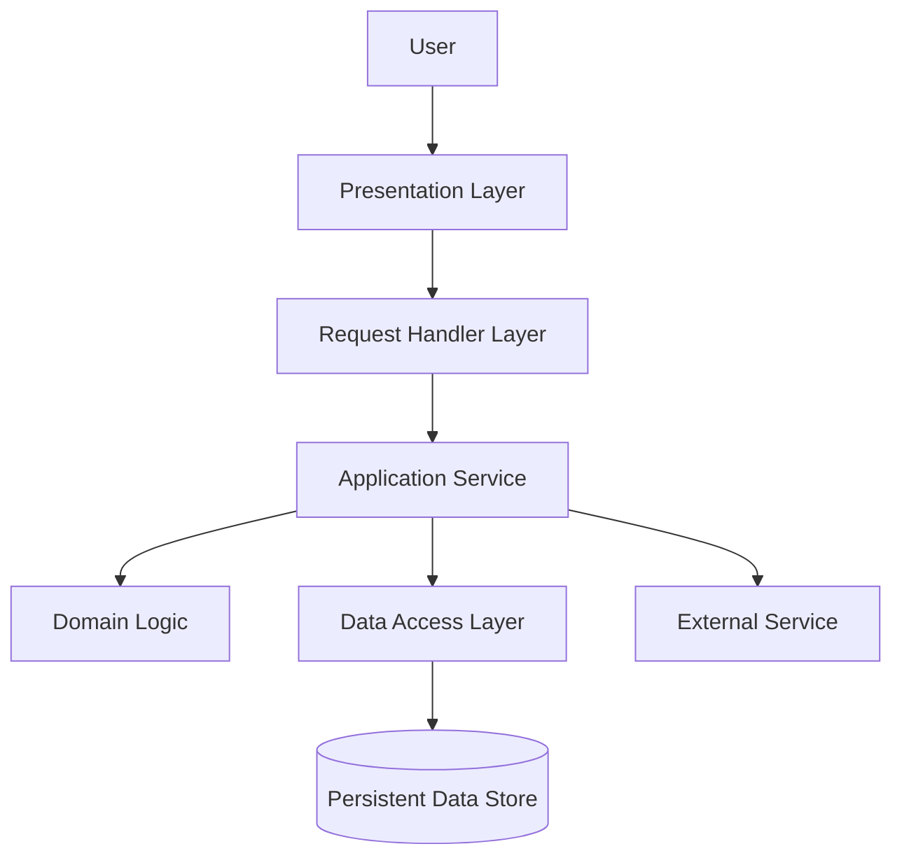
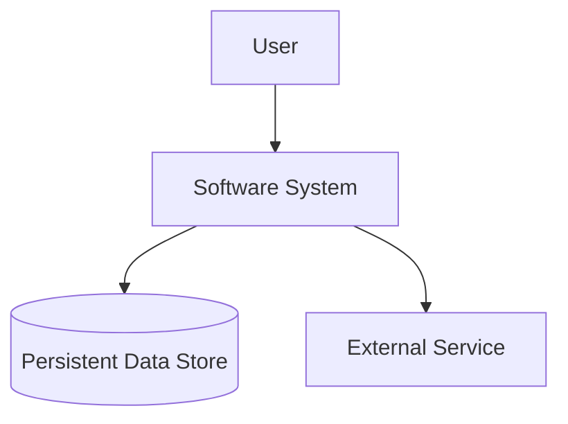
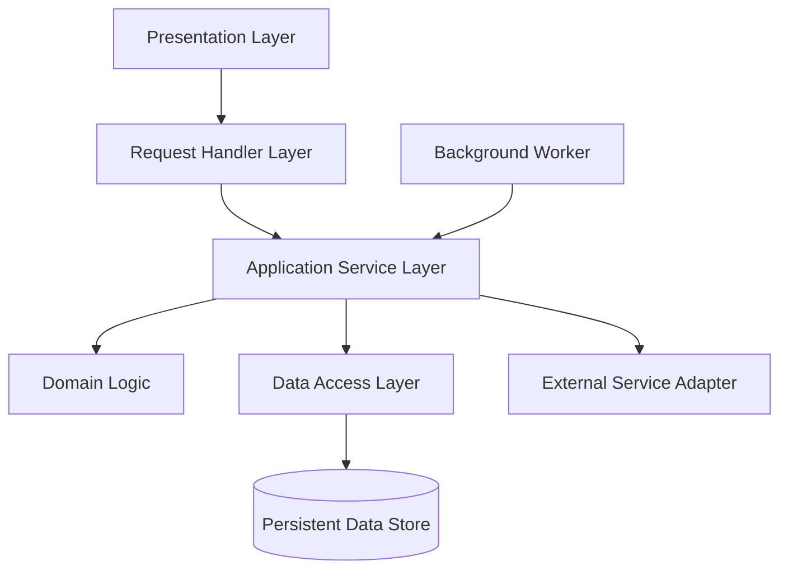
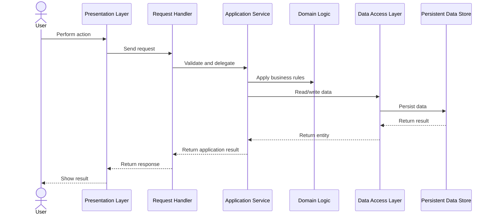
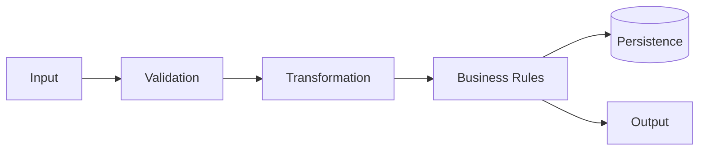

# Mermaid Diagrams

Use this reference to create architecture diagrams after understanding the project workflows and boundaries.

## Diagram Rules

- Generate Mermaid diagrams for the architecture.
- Prefer language-independent labels first.
- Add current implementation details in parentheses only when useful.
- Do not create diagrams from file names alone.
- Each diagram should include a short explanation and file evidence.
- Validate diagrams for Mermaid syntax where possible.

## Preferred Diagram Types

1. `flowchart TD` for component maps.
2. `sequenceDiagram` for request workflows.
3. `classDiagram` for domain model relationships when useful.
4. `erDiagram` for database entities.
5. `C4Context` or C4-style flowchart for system context if Mermaid C4 is not available.

## Generic Component Example



If useful, add current implementation details in parentheses:

```text
Request Handler Layer (FastAPI routes)
Data Access Layer (SQLAlchemy repositories)
```

## System Context Template



## Component Map Template



## Main Workflow Sequence Template



## Data Flow Template


