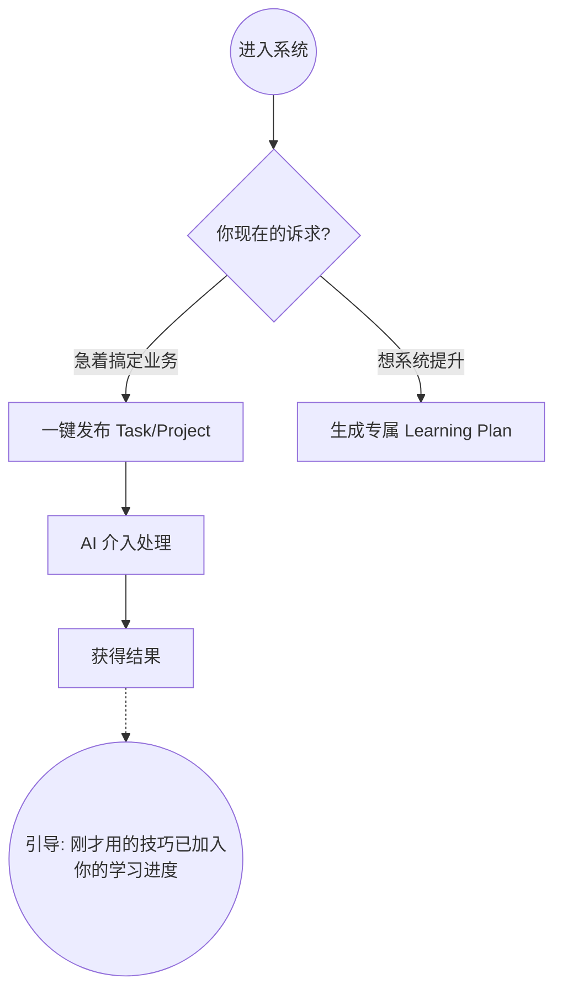
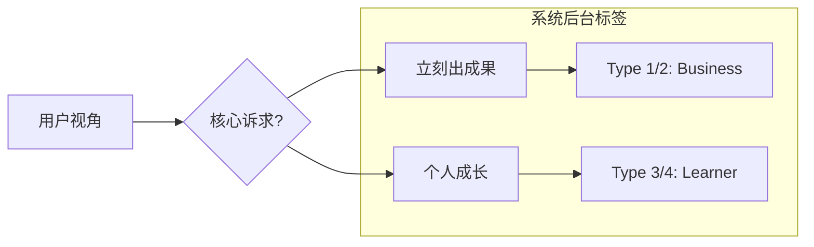

### 1. 核心矛盾：Business 用户的“要结果” vs “要学习”

在我们的设计里，给老板们定了 Learning Plan。但我作为用户跑下来，最大的感受是：**如果我手头正有个急事，我其实没耐心先去走完什么学习路径。**

我们需要给那群“只想赶紧把活干了”的人一个**Fast Track**

>[!Note] My own idea:
>**优化思路**：在 Onboard 的分流节点，别拦着他们学完再用。给个大按钮叫“跳过引导，直接发任务”。先让他尝到甜头，他后面才会有动力回过头来补课。

---

这个是我自己想出来的一个work flow，因为就我个人而言原来的流程图感觉是强制性的，我觉得我们的项目应该更像自我的成长，所以我添加了一个分支就是个人成长
