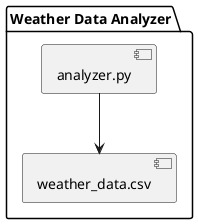

```yaml {"type":"meta"}
title: 'Python Programming Essentials: Mastering Loops'
slug: python-programming-essentials:-mastering-loops
duration: 45 minutes
last_step: 3
```


```markdown {"during":1000}
#### Topics in this session:

Python Programming Essentials: Mastering Loops

1. The Power of Repetition: Introduction to Loops in Python
2. The Power of Repetition: Introduction to Loops in Python
3. Bringing It All Together: Python Loops in Review

Embark on a coding adventure with 🐍 Python Programming Essentials: Mastering Loops! This interactive course is your gateway to mastering the art of repetition and automation in Python, utilizing a Linux Cloud Dev Container for a hands-on learning experience. 🔄 Dive into the world of 'for' and 'while' loops, and become fluent in the language of iteration!


```


```markdown {"type":"control","action":"continue","timeLeft":0}

```


```markdown {"during":1000}
### 1. The Power of Repetition: Introduction to Loops in Python

Discover the magic of loops in Python! 🎩✨ This opening section sets the stage for your journey into the efficient world of programming automation. Get ready to transform your ideas into reality by learning the key to handling repetitive tasks with ease and precision. 🔄


```


```markdown {"type":"control","action":"continue","timeLeft":0}

```


```markdown {"during":1000}
#### Course Objectives

* **Grasp the concept and utility of loops** in Python to automate tasks efficiently.
* **Apply loop constructs** to solve iterative programming challenges, enhancing your coding toolkit.
* **Develop proficiency** in using loops for data manipulation and task automation, preparing you for more advanced programming feats.
```


```markdown {"during":1000}
#### Keywords

* Python Loops
* For Loop
* While Loop
* Iteration
* Automation
* Repetition
* Programming
```


```markdown {"during":1000}
#### Prompts


```


```yaml {"type":"list","tag":"ol","default":true}
- What are some real-life scenarios where loops can be applied to **automate
  tasks**?
- How can understanding loops improve your **problem-solving skills** in
  programming?
- In what ways do 'for' and 'while' loops differ, and how can each be used
  **effectively**?
- Can you think of a situation where a **nested loop** would be necessary, and
  why?

```


```markdown {"during":1000}
### 2. The Power of Repetition: Introduction to Loops in Python

Embark on your programming adventure by discovering how loops can streamline complex tasks with automated processes. 🔄 This section lays the groundwork for your mastery of Python loops by introducing their syntax and practical applications.


```


```markdown {"type":"control","action":"continue","timeLeft":0}

```


```markdown {"during":1000}
#### Understanding Loop Basics in Python

Loops are a foundational concept in programming that allow you to execute a block of code repeatedly. Python provides 'for' and 'while' loops for handling iteration.


```


```markdown {"type":"chat","action":"code","button":"Ask AI","promptFor":"WithCode"}
Demonstrate a simple 'for' loop in Python that prints numbers from 1 to 5.
```


```markdown {"type":"control","action":"continue","timeLeft":0}

#### Setup your JuniorIT.AI Cloud Linux Development Environment

Once you're ready to start setting up your development container, click the button below to start the process. This will take a little of time to complete.

```


```markdown {"type":"container","action":"container","timeLeft":0}

```


```markdown {during: 1000}
#### Setting Up Your Workspace
Welcome to our cloud Linux development environment, designed to support your professional growth. To get started, we've arranged a project for you to engage with. Follow the steps below to prepare your workspace.

Please execute the following commands in your terminal. These instructions will guide you through cloning the project repository into your workspace folder.
```

```markdown {type: bash, vscode: false, clear: true}
cd ~/workspace

# Remove the existing project folder if it exists
rm -rf session-75311

git clone -b session-75311 https://github.com/juniorit-ai/student-projects.git session-75311
cd session-75311
```

```markdown {type: control, action: continue, history: 'session-75311', error: 'Please make sure you have run the shell commands above and are in the project folder in the current terminal window.'}
With the project setup complete, you're ready to dive into the course content. This project will serve as a practical foundation to apply and deepen your understanding of the course's concepts and knowledge.

Now, please click the "Continue" button to proceed to the next phase of the course.
```


```markdown {"during":1000}
#### undefined


```


undefined


```markdown {"during":1000}
>You can use the hand icon to request AI to explain the code, or use the pencil icon to ask the AI to add comments for better understanding.
```


```python {"type":"code","action":"run","codeOnly":true,"handBtn":true,"commentBtn":true}
for i in range(1, 6):
    print(i)
```


```markdown {"during":1000}
Please open the file 'playground/for_loop_basics.py' in the Linux cloud dev container and run the code to view the output with the command below. 👩‍💻
```


```markdown {"type":"bash","vscode":false,"clear":true}

# Make sure you are in the folder playground
cd ~/workspace/session-75311/playground
# Open the file in the code editor
jcode for_loop_basics.py

python for_loop_basics.py
```


```markdown {"type":"control","action":"continue","history":"for_loop_basics.py","error":"Please make sure you have run the shell commands above."}
Once you have run the shell commands above, click the "Continue" button to proceed to the next phase of the course.
```


```markdown {"during":1000}
#### Quiz: Identifying Loop Use Cases

Select the scenario where a 'for' loop is the most appropriate choice.


```


```tabs {}

\```text {"type":"code","action":"none","title":"A"}
Printing each element in a list of names.
\```


\```text {"type":"code","action":"none","title":"B"}
Calculating the sum of numbers until the sum exceeds 100.
\```


\```text {"type":"code","action":"none","title":"C"}
Reading a file until a specific word is found.
\```


\```text {"type":"code","action":"none","title":"D"}
Sending an email every day at noon.
\```

```


```yaml {"type":"form"}
- name: 7bce4f7a48014c9789278daf077bd5b9
  label: Which of these scenarios is best suited for a 'for' loop?
  options:
    - Printing each element in a list of names
    - Calculating the sum of numbers until the sum exceeds 100
    - Reading a file until a specific word is found
    - Sending an email every day at noon
  type: radio
  value: 0

```


```yaml {"type":"form"}
- name: 1dad06255e064b6ea35ad073f9018310
  label: Why are loops useful in programming?
  options:
    - They allow the programmer to sleep while the code runs.
    - They enable code to execute repeatedly without manual intervention.
    - They make the code longer and more complex.
    - They are only used in Python and no other programming language.
  type: radio
  value: 1

```


```yaml {"type":"form"}
- name: 57f60cf9b7454806b47c21ae3adf1060
  label: What does the range function do in a 'for' loop?
  options:
    - It generates a list of numbers within a specified range.
    - It counts the number of loops executed.
    - It randomly selects a number to start the loop with.
    - It defines the number of times a loop should run.
  type: radio
  value: 0

```


```markdown {"during":1000}
### 3. Bringing It All Together: Python Loops in Review

🎓 Congrats on completing 'Python Programming Essentials: Mastering Loops'! This final section will help cement your understanding, answer lingering questions, and put your skills to the test with a real-world project. Let's loop back and review what you've learned! 🔄


```


```markdown {"type":"control","action":"continue","timeLeft":0}

```


```markdown {"during":1000}
#### Loop Recap: Solidifying the Basics

* Loops are fundamental structures in Python that allow for repetitive task execution.
* 'For' loops are ideal for iterating over sequences such as lists, tuples, and strings.
* 'While' loops are used when you want to repeat an action until a certain condition changes.
* Nested loops are useful for working with multi-dimensional data structures like matrices.
* Control statements like 'break' and 'continue' alter the flow of loops for more complex logic.
```


```markdown {"during":1000}
#### Frequently Asked Questions


```


```yaml {"type":"list","tag":"ol","default":true}
- How do I choose between a 'for' loop and a 'while' loop?
- What is an infinite loop, and how can it be prevented?
- When would I use a nested loop instead of a single loop?
- Can you explain the purpose of the 'break' and 'continue' statements in loops?

```


```yaml {"type":"form"}
- name: 5dec389970034d77978b4c5009061e7b
  label: "Which loop type would you use to iterate over the following list: [1, 2,
    3, 4, 5]?"
  options:
    - "'For' loop"
    - "'While' loop"
    - Nested loop
    - No loop is needed
  type: radio
  value: 0

```


```markdown {"type":"control","action":"continue","timeLeft":0}

#### Setup your JuniorIT.AI Cloud Linux Development Environment

Once you're ready to start setting up your development container, click the button below to start the process. This will take a little of time to complete.

```


```markdown {"type":"container","action":"container","timeLeft":0}

```


```markdown {during: 1000}
#### Setting Up Your Workspace
Welcome to our cloud Linux development environment, designed to support your professional growth. To get started, we've arranged a project for you to engage with. Follow the steps below to prepare your workspace.

Please execute the following commands in your terminal. These instructions will guide you through cloning the project repository into your workspace folder.
```

```markdown {type: bash, vscode: false, clear: true}
cd ~/workspace

# Remove the existing project folder if it exists
rm -rf session-75311

git clone -b session-75311 https://github.com/juniorit-ai/student-projects.git session-75311
cd session-75311
```

```markdown {type: control, action: continue, history: 'session-75311', error: 'Please make sure you have run the shell commands above and are in the project folder in the current terminal window.'}
With the project setup complete, you're ready to dive into the course content. This project will serve as a practical foundation to apply and deepen your understanding of the course's concepts and knowledge.

Now, please click the "Continue" button to proceed to the next phase of the course.
```


```markdown {"during":1000}
#### Python Loop Proficiency Project: Weather Data Analyzer

🌤️ Dive into a real-world scenario where you'll harness the power of loops to analyze weather data. Your goal is to process a dataset and extract meaningful insights using Python loops. 📊


```


```markdown {"during":1000}
\```
weather_data_analyzer/
├── src/
│   └── analyzer.py
└── data/
    └── weather_data.csv
\```
```


```markdown {"during":1000}
#### Weather Data Analyzer UML Diagram


```





```markdown {"during":1000}
The diagram illustrates the relationship between the Python script 'analyzer.py' and the dataset 'weather_data.csv'. The script processes the data file to perform the analysis.
```


```markdown {"during":1000}
To complete this project, you'll need to read from 'weather_data.csv', calculate average temperatures, and identify trends over time. Make sure to implement both 'for' and 'while' loops where appropriate. 🛠️
```


```markdown {"type":"bash","vscode":false,"clear":true}

# Make sure you are in the project folder weather_data_analyzer
cd ~/workspace/session-75311/weather_data_analyzer

# Navigate to the src directory
cd weather_data_analyzer/src
# Run the Python analyzer script
python analyzer.py
```


```markdown {"type":"control","action":"continue"}
Once you have finished this project, click the "Continue" button below.
```


```markdown {"type":"control","action":"submit","timeLeft":0}

```


```markdown {"type":"control","action":"end"}
Congratulations on completing this lesson! Your dedication and hard work have paid off, marking another step forward in your learning journey. 
Remember, each lesson is a building block towards mastering new skills and expanding your knowledge. 
Take a moment to reflect on what you've learned and how you can apply it going forward. 
```
